# Unloop

A mobile-first landing page for **Unloop**, an app that helps you get your time back from the scroll. Plain HTML, CSS and JavaScript, no build step.

<p align="center">
  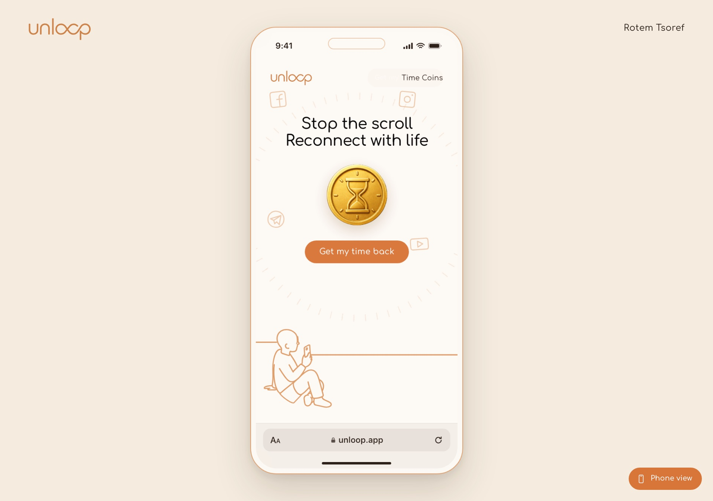
</p>

> You don't need to run anything to see it. The screenshots below walk through the whole page.

## The page, top to bottom

<table>
  <tr>
    <td align="center">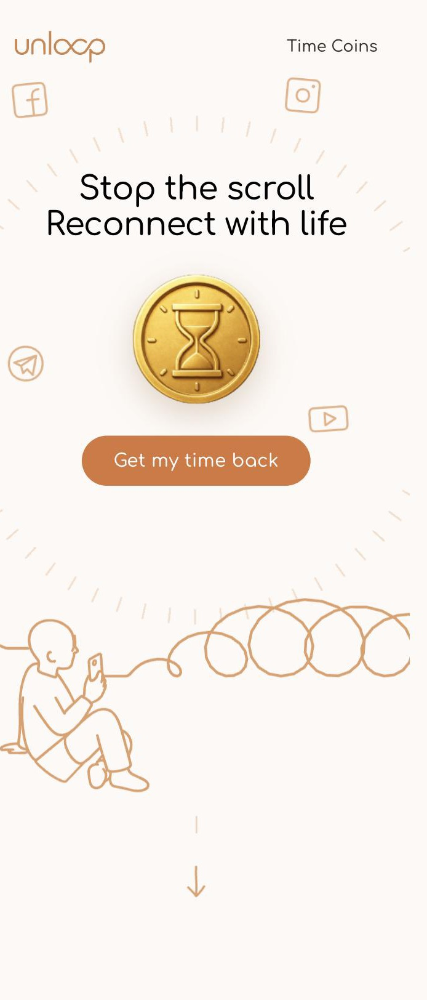<br><sub>1. Hero</sub></td>
    <td align="center">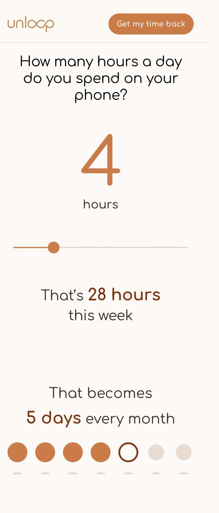<br><sub>2. Hours you spend</sub></td>
    <td align="center">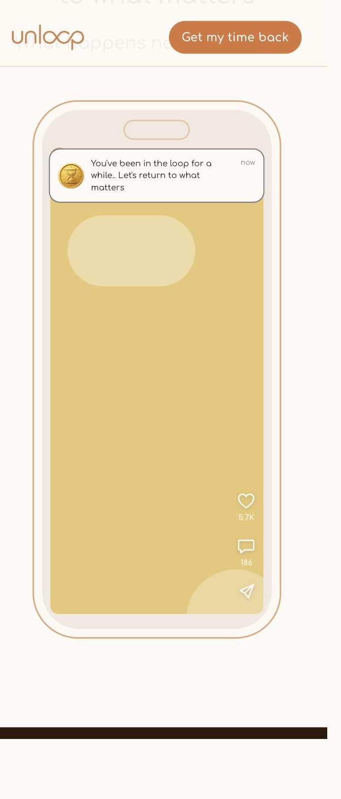<br><sub>3. The nudge</sub></td>
  </tr>
  <tr>
    <td align="center">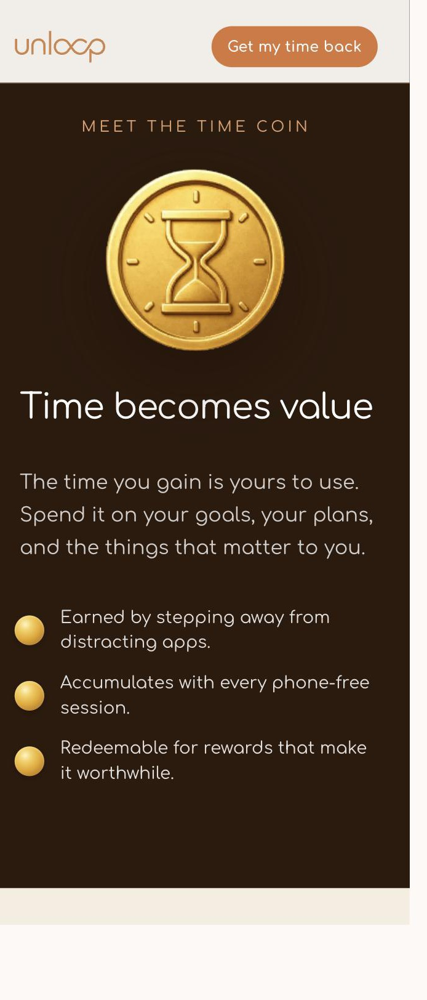<br><sub>4. Time coin</sub></td>
    <td align="center">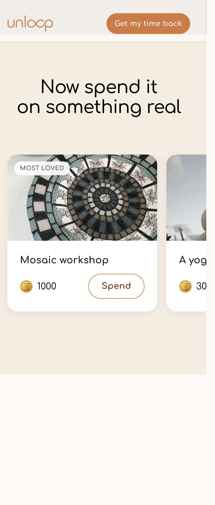<br><sub>5. Rewards</sub></td>
    <td align="center">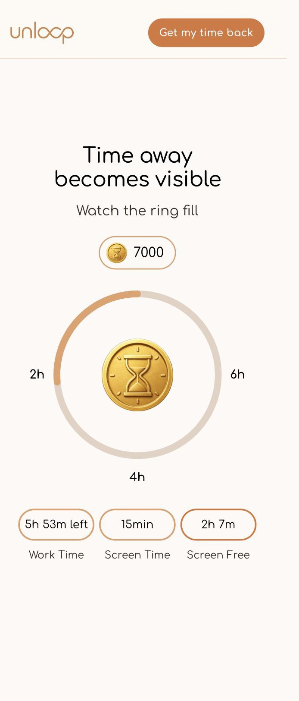<br><sub>6. Progress ring</sub></td>
  </tr>
  <tr>
    <td align="center">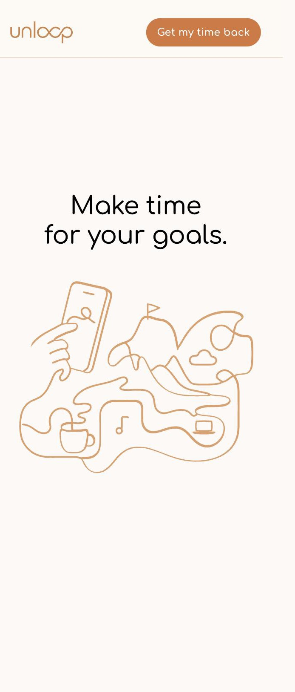<br><sub>7. Goals</sub></td>
    <td align="center">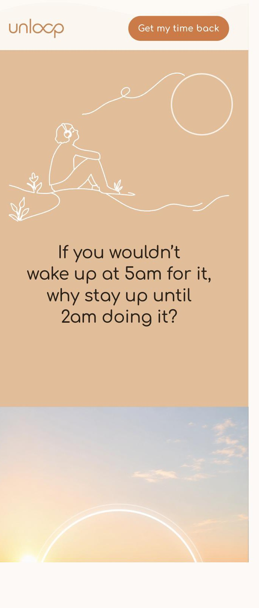<br><sub>8. The field</sub></td>
    <td align="center">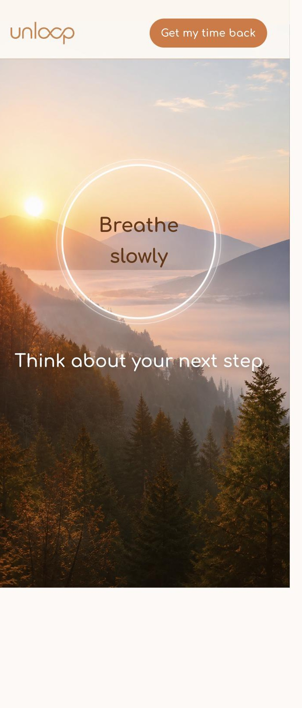<br><sub>9. Breathe</sub></td>
  </tr>
  <tr>
    <td align="center">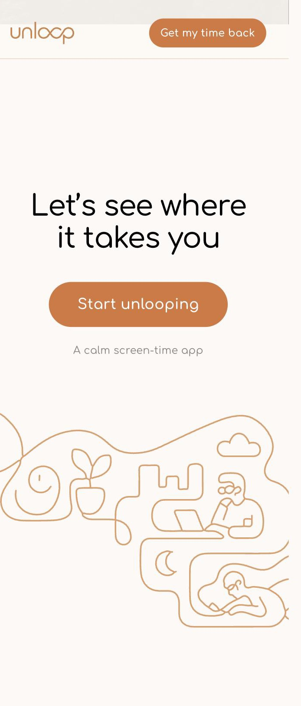<br><sub>10. Closing</sub></td>
    <td></td>
    <td></td>
  </tr>
</table>

## Design

Designed in Figma, then built in code.

- **Design file:** [Unloop app](https://www.figma.com/design/6oSKOWbZRth3iT2ftMies2/Unloop-app)
- **Prototype:** [Open the Figma prototype](https://www.figma.com/proto/LNkayS6aPpT4VlgASoFyzE/TimeLimit?node-id=3880-66140&viewport=-12287%2C3564%2C0.67&t=mZxE95JwZEhll1pa-1&scaling=scale-down&content-scaling=fixed&starting-point-node-id=3880%3A66140&page-id=3873%3A26031) (the "Get my time back" and "Start unlooping" buttons link here)

<table>
  <tr>
    <td align="center">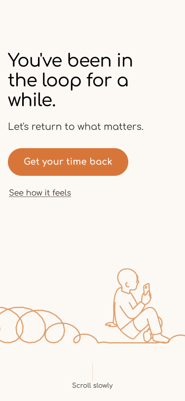<br><sub>Hero frame</sub></td>
    <td align="center">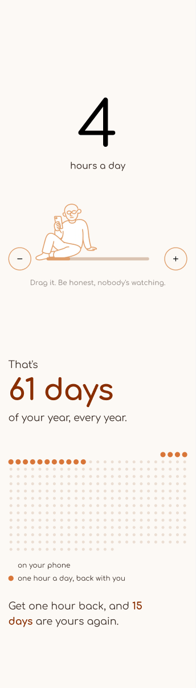<br><sub>Hours frame</sub></td>
    <td align="center">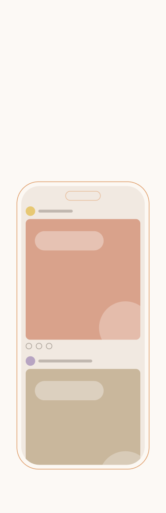<br><sub>Feed / nudge frame</sub></td>
  </tr>
</table>

## Phone view

On a desktop the page can be shown inside an iPhone frame (390 x 844) with Safari chrome around it. Switch it on with:

- the toggle button on the page,
- the **P** key, or
- `?phone=1` at the end of the URL.

## Run it

Needs Node 18+. No dependencies to install.

```bash
npm start
```

Then open <http://localhost:8460>. Any other static server pointed at the `landing/` folder works too.

## Project structure

```
landing/
  index.html          the page
  css/styles.css      all styles
  js/main.js          scroll, reveal and section animations
  js/device-view.js   phone-view presentation mode
  assets/             images and illustrations
  docs/               screenshots used in this README
  serve.mjs           tiny static server used by `npm start`
package.json
```

## Notes

- This is a mockup page. Store buttons are placeholders and are hidden; the main buttons open the Figma prototype.
- Content in the feed and stats is illustrative.
- Typeface: Comfortaa, loaded from Google Fonts.
- Animations respect `prefers-reduced-motion`.

---

Design & development by Rotem Tsoref.
